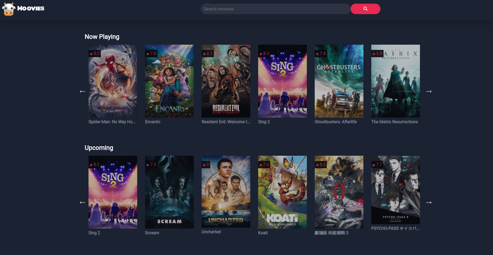

<div id="top"></div>

<!-- HEADER -->
<br />
<div align="center">
    

  <h3 align="center">Moovies</h3>

  <p align="center">
    Search for your favorite or upcoming movies and TV shows.
    <br />
    <a href="https://caz-moovies.netlify.app/"><strong>View Demo »</strong></a>
    <br />
    <br />
  </p>
</div>

<!-- ABOUT -->
## About



Online database similar to IMDB featuring films and TV shows. Powered by The Movie Database API.

### Built With

* [The Movie Database API](https://www.themoviedb.org/documentation/api?language=en-US)
* HTML
* CSS
* Javascript

<!-- GETTING STARTED -->
## Getting Started

### Installation

1. Get a free API Key [here](https://developers.themoviedb.org/3/getting-started)
2. Clone the repo
3. Add your API Key to config.js by replacing the value for ```API_KEY```
4. Start a [local server](https://marketplace.visualstudio.com/items?itemName=ritwickdey.LiveServer)

<!-- USAGE EXAMPLES -->
## Usage

Use the search box at the top to find a particular film, or simply browse the home page for anything currently in theaters or upcoming. 

<!-- CONTRIBUTING -->
## Contributing

Any contributions you make are **greatly appreciated**.

If you have a suggestion that would make this better, please fork the repo and create a pull request.

1. Fork the Project
2. Create your Feature Branch (`git checkout -b feature/MyGreatFeatureRequest`)
3. Commit your Changes (`git commit -m 'Add some features'`)
4. Push to the Branch (`git push origin feature/MyGreatFeatureRequest`)
5. Open a Pull Request

<!-- LICENSE -->
## License

Distributed under the GPLv3 License. See `LICENSE` for more information.

<p align="right">(<a href="#top">back to top</a>)</p>